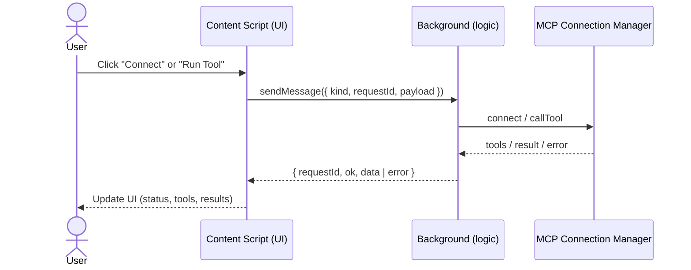

# DESIGN

Scope: Architecture blueprint for the Chrome MV3 extension, including components, message flow, storage model, DOM strategy, and extensibility. Derived from the redesign plan; no new features or APIs are introduced here.
Last updated: 2025-09-03 (UTC)

## Architecture blueprint

### High-level components

- Content Script = UI only: Injects Shadow DOM UI (floating toggle and sidebar), handles user inputs, renders results, and uses chrome.runtime messaging only.
- Background = logic only: Owns logic, state, storage access, and integration with external MCP servers. Receives structured messages and returns structured responses.
- Storage & Settings module (Background): Defines data schema, manages chrome.storage (sync for config, local for status/logs), supports versioning/migrations.
- MCP Connection Manager (Background): Manages active connections to MCP servers (e.g., WebSocket JSON-RPC), encapsulating connect/disconnect and tool invocation.
- MCP Server Adapters (future): Pattern for different transports (WebSocket, HTTP) without changing UI or message contracts.

### Modular code layout

- content/
  - ui: UI components and tab switching.
  - dom: mounting, stable selectors, MutationObserver, fallbacks.
  - messaging: thin wrapper for chrome.runtime.sendMessage with typed message schema.
- background/
  - background entry: registers listeners and wires modules.
  - state: storage schema, get/set, migrations.
  - mcp-manager: connections and RPC handling.
  - handlers: message router mapping kinds to handlers.

## Separation of concerns

- UI vs logic: Content Script never includes business logic or external calls. Background never manipulates the page DOM.
- typed message schema: Stable request/response envelopes with enumerated kinds; responses carry ok and either data or error.
- storage: sync vs local: Persistent configuration in sync; ephemeral status/logs in local.

## Message flow

- One-shot chrome.runtime messaging for requests like LIST_SERVERS, CONNECT_MCP, CALL_MCP_TOOL, TOGGLE_SERVER, SET_DEFAULT, GET_SETTINGS, SET_SETTINGS, LIST_MCP_TOOLS.
- Background dispatches to handlers which use MCP Connection Manager as needed.
- Responses are structured and include ok: true|false and data|error.

### Sequence (simplified)

## Storage model

- chrome.storage.sync: servers, defaultServerId, metadata. Versioned; migrate on install/update.
- chrome.storage.local: last-known statuses, logs (bounded, e.g., 500 entries), other volatile data.

## DOM strategy

- Shadow DOM encapsulation for all injected UI.
- Stable selectors where possible (prefer data-* / roles over brittle classes).
- MutationObserver with fallback: observe key containers (e.g., composer area), reattach on SPA re-renders; if anchoring fails, show a visible fixed-position fallback so the UI never disappears.
- Avoid interference: don’t alter the host page’s DOM outside of mounting points; isolate styles.

## Extensibility notes

- Add new MCP servers via configuration; UI remains agnostic and driven by the Background’s reported tools.
- Future adapter(s) for additional protocols should be isolated within the MCP Connection Manager.
- Prepare (not implement) for potential streaming by keeping the messaging/router modular; current flow remains one-shot.

## Component interaction map (summary)

Content UI (Shadow DOM) ↔ messaging ↔ Background handlers → [Storage, Connection Manager, etc.] → external MCP servers.
